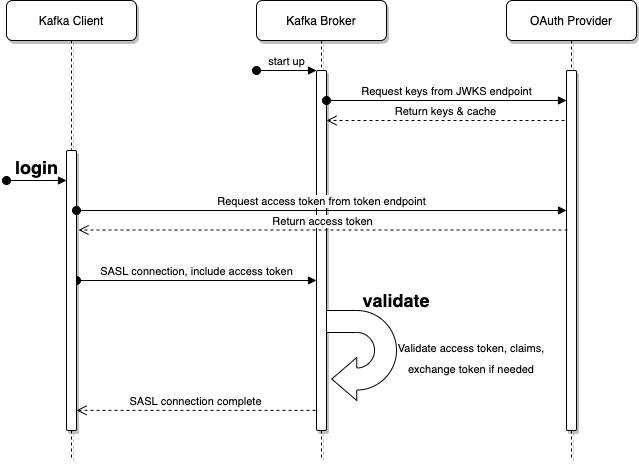

# How kafka supports OAUTHBEARER token?
​
1. At the first kafka supported the **OAuth Authentication via SASL/OAUTHBEARER** which has been documented in [KIP-255](https://cwiki.apache.org/confluence/pages/viewpage.action?pageId=75968876) and has been implemented in the jira ticket [KAFKA-6562](https://issues.apache.org/jira/browse/KAFKA-6562) , the implementation of KIP-255 provided a concrete example implementation that allowed clients to provide an **unsecured JWT access token** to the broker when initializing the connection only for ”**development scenarios**”, NOT for **production cases**.  [Run kafka in SASL_PLAINTEXT+OAUTHBEARER with unsecure token](https://github.com/leiwang008/documents/blob/main/kafka/how_to_run_kafka_in_sasl_plaintext_oauthbearer_with_default_unsecure_token.md)

2. Now kafka supports **Extend SASL/OAUTHBEARER with Support for OIDC** which has been documented in [KIP-768](https://cwiki.apache.org/confluence/pages/viewpage.action?pageId=186877575) and has been implemented in the jira ticket [KAFKA-13202](https://issues.apache.org/jira/browse/KAFKA-13202) , the implementation of KIP-768 provides a concrete implementation of the interfaces defined in [KIP-255](https://cwiki.apache.org/confluence/pages/viewpage.action?pageId=75968876) to allow Kafka to connect to an Open ID identity provider for authentication and token retrieval and it can be used in **production cases**. [Run kafka in SASL_PLAINTEXT+OAUTHBEARER mode with OIDC secure token](https://github.com/leiwang008/documents/blob/main/kafka/how_to_run_kafka_in_sasl_plaintext_oauthbearer_with_oidc_token.md)  
Below is how kafka works with OAUTHBEARER/OIDC



# How to config kafka to run with SASL/OAUTHBEARER OIDC?
Client Configuration
The name of the implementation class will be [org.apache.kafka.common.security.oauthbearer.OAuthBearerLoginCallbackHandler](https://github.com/a0x8o/kafka/blob/master/clients/src/main/java/org/apache/kafka/common/security/oauthbearer/OAuthBearerLoginCallbackHandler.java) and it will accept instances of org.apache.kafka.common.security.oauthbearer.OAuthBearerTokenCallback and org.apache.kafka.common.security.auth.SaslExtensionsCallback. The fully-qualified class name will be provided to the client's **sasl.login.callback.handler.class** configuration.

Broker Configuration
The name of the implementation class will be [org.apache.kafka.common.security.oauthbearer.OAuthBearerValidatorCallbackHandler](https://github.com/a0x8o/kafka/blob/master/clients/src/main/java/org/apache/kafka/common/security/oauthbearer/OAuthBearerValidatorCallbackHandler.java) and it will accept instances of org.apache.kafka.common.security.oauthbearer.OAuthBearerValidatorCallback and org.apache.kafka.common.security.oauthbearer.OAuthBearerExtensionsValidatorCallback. The fully-qualified class name will be provided to the broker's **listener.name.<listener name>.oauthbearer.sasl.server.callback.handler.class** configuration.

- Many kafka's documents are out of date, you should read the source code comments ([org.apache.kafka.common.security.oauthbearer.OAuthBearerLoginCallbackHandler](https://github.com/a0x8o/kafka/blob/master/clients/src/main/java/org/apache/kafka/common/security/oauthbearer/OAuthBearerLoginCallbackHandler.java) and [org.apache.kafka.common.security.oauthbearer.OAuthBearerValidatorCallbackHandler](https://github.com/a0x8o/kafka/blob/master/clients/src/main/java/org/apache/kafka/common/security/oauthbearer/OAuthBearerValidatorCallbackHandler.java)) to know the precise parameter to use in the config file.

- Many sasl config properties are defined in [org.apache.kafka.common.config.SaslConfigs](https://github.com/a0x8o/kafka/blob/master/clients/src/main/java/org/apache/kafka/common/config/SaslConfigs.java), refer to it to know the correct property to use in config file.

- When we look at the **kafka-server-start.sh**, we can see the following instruction
```bash
exec $base_dir/kafka-run-class.sh $EXTRA_ARGS kafka.Kafka "$@"
```
the main entrance class [kafka.Kafka](https://github.com/a0x8o/kafka/blob/master/core/src/main/scala/kafka/Kafka.scala) is a scala class, and it is in the **core** folder of kafka.

- When we look at the **kafka-console-producer.sh**, we can see the following instruction
```bash
exec $(dirname $0)/kafka-run-class.sh kafka.tools.ConsoleProducer "$@"
```
the main entrance class [kafka.tools.ConsoleProducer](https://github.com/a0x8o/kafka/blob/master/core/src/main/scala/kafka/tools/ConsoleProducer.scala) is a scala class, and it is in the **core** folder of kafka.

- When we look at the **kafka-console-consumer.sh**, we can see the following instruction
```bash
exec $(dirname $0)/kafka-run-class.sh kafka.tools.ConsoleConsumer "$@"
```
the main entrance class [kafka.tools.ConsoleConsumer](https://github.com/a0x8o/kafka/blob/master/core/src/main/scala/kafka/tools/ConsoleConsumer.scala) is a scala class, and it is in the **core** folder of kafka.

